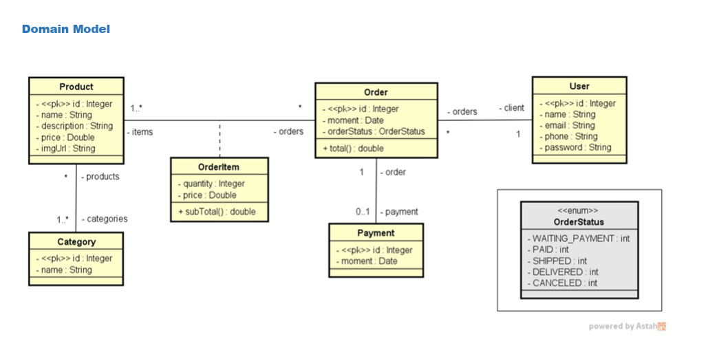

# Spring Boot - Web Services com JPA / Hibernate
[](https://github.com/guilhermenoe2020-netizen/workshop-springboot4-jpa/blob/main/LICENSE)

# Sobre o projeto

Este projeto é uma **API RESTful** desenvolvida com **Java + Spring Boot**, construída como estudo prático de desenvolvimento back-end. O objetivo é simular o back-end de um sistema de **e-commerce**, com entidades como usuários, pedidos, produtos, categorias, itens de pedido e pagamentos.

O projeto aplica os principais conceitos do ecossistema Spring, incluindo criação de uma API REST completa com operações **CRUD**, mapeamento objeto-relacional com **JPA/Hibernate**, banco de dados em memória **H2** para testes, tratamento de **exceções customizadas** com respostas HTTP padronizadas e arquitetura em camadas.

## Modelo conceitual



# Tecnologias utilizadas
## Back end
- Java 25
- Spring Boot 4.1.1
- JPA / Hibernate
- Maven
- H2 Database (banco em memória para testes)
- Jackson (serialização JSON)

# Arquitetura em camadas

```
Client (Postman / Browser)
        │
        ▼
   Resource Layer    ← Controllers REST (@RestController)
        │
        ▼
   Service Layer     ← Regras de negócio (@Service)
        │
        ▼
  Repository Layer   ← Acesso ao banco (JpaRepository)
        │
        ▼
   H2 Database       ← Banco em memória (perfil "test")
```

# Entidades

## User
Tabela: `tb_user`

| Campo | Tipo | Descrição |
|---|---|---|
| id | Long | PK auto-gerada |
| name | String | Nome |
| email | String | E-mail |
| phone | String | Telefone |
| password | String | Senha |
| orders | List\<Order\> | Pedidos do usuário (`@JsonIgnore`) |

Relacionamento: Um usuário tem muitos pedidos (`@OneToMany`).

## Order
Tabela: `tb_order`

| Campo | Tipo | Descrição |
|---|---|---|
| id | Long | PK |
| moment | Instant | Data/hora do pedido |
| orderStatus | Integer | Status como inteiro (mapeado via enum) |
| client | User | Usuário dono do pedido (`@ManyToOne`) |
| items | Set\<OrderItem\> | Itens do pedido |
| payment | Payment | Pagamento (`@OneToOne`, `CascadeType.ALL`) |

Método especial: `getTotal()` — soma os subtotais de todos os itens.

## Product
Tabela: `tb_product`

| Campo | Tipo | Descrição |
|---|---|---|
| id | Long | PK |
| name | String | Nome |
| description | String | Descrição |
| price | Double | Preço |
| imgUrl | String | URL da imagem |
| categories | Set\<Category\> | Categorias (`@ManyToMany`) |

Tabela intermediária: `tb_product_category`

## Category
Tabela: `tb_category`

| Campo | Tipo | Descrição |
|---|---|---|
| id | Long | PK |
| name | String | Nome |
| products | Set\<Product\> | Produtos (`@JsonIgnore`, lado inverso) |

## OrderItem
Tabela: `tb_order_item`

Entidade de associação entre `Order` e `Product` com atributos extras.

| Campo | Tipo | Descrição |
|---|---|---|
| id | OrderItemPk | Chave composta (order + product) |
| quantity | Integer | Quantidade |
| price | Double | Preço unitário no momento da compra |

Método especial: `getSubTotal()` → `price * quantity`

> Como a tabela de associação tem atributos próprios, não é possível usar apenas `@ManyToMany`. Por isso foi criada uma entidade separada com `@EmbeddedId`.

## Payment
Tabela: `tb_payment`

| Campo | Tipo | Descrição |
|---|---|---|
| id | Long | PK compartilhada com Order (`@MapsId`) |
| moment | Instant | Data/hora do pagamento |
| order | Order | Pedido associado (`@JsonIgnore`) |

> `@MapsId` faz o `id` do Payment ser o mesmo `id` do Order — chave dependente.

## OrderStatus (Enum)

| Valor | Código |
|---|---|
| WAITING_PAYMENT | 1 |
| PAID | 2 |
| SHIPPED | 3 |
| DELIVERED | 4 |
| CANCELED | 5 |

> Armazenado como inteiro para que renomear o enum no futuro não quebre os dados do banco.

# Endpoints da API

## Usuários — `/users`

| Método | Endpoint | Descrição | Status |
|---|---|---|---|
| GET | `/users` | Lista todos | 200 |
| GET | `/users/{id}` | Busca por ID | 200 |
| POST | `/users` | Cria usuário | 201 |
| PUT | `/users/{id}` | Atualiza nome/email/telefone | 200 |
| DELETE | `/users/{id}` | Remove | 204 |

> O PUT **não atualiza a senha** — apenas `name`, `email` e `phone`.

## Pedidos — `/orders`

| Método | Endpoint | Descrição |
|---|---|---|
| GET | `/orders` | Lista todos |
| GET | `/orders/{id}` | Busca por ID (com itens, pagamento e total) |

## Produtos — `/products`

| Método | Endpoint | Descrição |
|---|---|---|
| GET | `/products` | Lista todos |
| GET | `/products/{id}` | Busca por ID (com categorias) |

## Categorias — `/categories`

| Método | Endpoint | Descrição |
|---|---|---|
| GET | `/categories` | Lista todas |
| GET | `/categories/{id}` | Busca por ID |

# Tratamento de Exceções

| Exceção | Quando é lançada | Status HTTP |
|---|---|---|
| `ResourceNotFoundException` | Recurso não encontrado pelo ID | 404 Not Found |
| `DataBaseException` | Violação de integridade no banco | 400 Bad Request |

Resposta padronizada (`StandardError`):
```json
{
  "timestamp": "2024-01-15T10:30:00Z",
  "status": 404,
  "error": "Resource not found",
  "message": "Resource not found. Id 99",
  "path": "/users/99"
}
```

# Como executar o projeto

## Back end
Pré-requisitos: Java 25

```bash
# clonar repositório
git clone https://github.com/guilhermenoe2020-netizen/workshop-springboot4-jpa

# entrar na pasta do projeto
cd workshop-springboot4-jpa

# executar o projeto (Windows)
mvnw.cmd spring-boot:run

# executar o projeto (Linux/Mac)
./mvnw spring-boot:run
```

## Acessando a API

```
Base URL: http://localhost:8080
```

## Console H2 (banco de dados em memória)

```
URL:      http://localhost:8080/h2-console
JDBC URL: jdbc:h2:mem:testdb
User:     sa
Password: (deixar em branco)
```

# Conceitos importantes aplicados

**`@JsonIgnore`** — Evita referência circular na serialização JSON entre entidades com relacionamento bidirecional.

**`@EmbeddedId`** — Chave primária composta em `OrderItem`, encapsulada na classe `OrderItemPk` com `@Embeddable`.

**`@MapsId`** — `Payment` compartilha o mesmo ID do `Order` (chave dependente).

**`CascadeType.ALL`** — Ao salvar/deletar um pedido, o pagamento associado é salvo/deletado automaticamente.

**`@ControllerAdvice`** — Centraliza o tratamento de exceções em um único lugar para toda a aplicação.

**`@Transactional`** — Garante que a operação de atualização seja executada dentro de uma única transação, permitindo que as alterações na entidade sejam sincronizadas com o banco de dados ao final da operação.

**`CommandLineRunner`** — `TestConfig` popula o banco automaticamente ao iniciar a aplicação no perfil `test`.

# Agradecimentos

Este projeto foi desenvolvido durante meus estudos de Java e Spring Boot,
com base no curso do [DevSuperior](https://devsuperior.com.br/)

# Autor

Guilherme Noé

https://github.com/guilhermenoe2020-netizen
